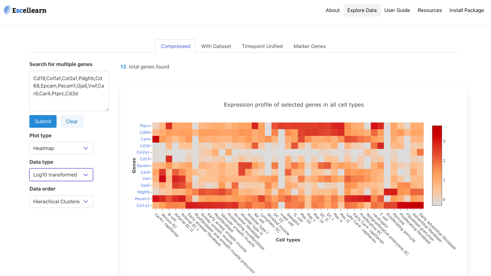

# data-compression-and-APIs-for-cell-atlases

Single cell RNA sequencing has emerged as a cutting-edge technology
to provide insights into the transcriptome of a tissue at single cell level. 
Here,we present 'Escellearn', providing heatmap visualisation of 
time dependent gene expression in different cell types with an 
easy-to-use interface. The portal will be demonstrated as a tool to 
explore the compressed dataset from a study about immune cell development in neonatal lung atlas.

Example Use Cases

